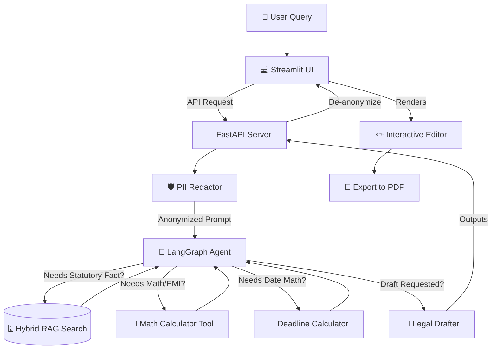

# 🇮🇳 Bharat Law GPT
**An advanced Agentic AI legal assistant for Indian Law, featuring a decoupled FastAPI + Streamlit architecture, robust PII Redaction, Hybrid RAG pipeline, and dynamic tool execution.**

## 📌 Overview
Bharat Law GPT is a highly sophisticated AI system designed to answer complex legal questions, compute mathematical legal formulas (like EMIs or fines), calculate legal deadlines, scrape the web for recent rulings, and instantly draft interactive professional legal documents.

Unlike generic chatbots, this project uses **Agentic AI** powered by LangGraph, giving the default **Llama 4 Scout 17B** LLM autonomous access to a suite of highly specialized tools.

This makes the system:
- **More accurate** (Answers grounded in uploaded PDFs via Hybrid FAISS/BM25 Search)
- **More mathematically precise** (Executes safe Python code to calculate fines or interest instead of hallucinating)
- **More autonomous** (Dynamically asks for missing facts, searches the web, and handles full drafting workflows)
- **Highly secure** (A dedicated PII Redactor ensures sensitive names and IDs never reach external LLM endpoints)

Now featuring a **Decoupled Client-Server Architecture**:
- **🚀 High-Performance Backend:** A fully decoupled FastAPI server handles SSE streaming, agent execution, and tool execution.
- **💻 Seamless Interactive Frontend:** A sleek Streamlit UI provides voice dictation, Shift+Enter multi-line text areas, and a dedicated **Interactive Markdown Editor** to review and download generated drafts.
- **⚙️ Configurable AI:** Toggle models in the sidebar, clear histories, or choose between light/dark themes in a sliding glassmorphic sidebar.

---

## 🎨 Workflows & Architecture

### 1️⃣ The Agentic AI Loop (LangGraph)
The core "brain" operates as a ReAct Agent on the FastAPI backend, utilizing a strict sequential reasoning loop.



---

## ✨ Key Features
- **Decoupled Architecture:** Clean separation of concerns with a FastAPI backend and Streamlit frontend, ready for Docker orchestration and production deployment.
- **PII Protection Pipeline:** Sensitive Indian names, Aadhaar numbers, PAN cards, and emails are aggressively anonymized into zero-shot tokens (`[AADHAAR_0]`) before sending to LLM providers, ensuring total privacy.
- **Strict Sequential Tooling:** The Llama 4 agent is hard-prompted to handle mathematical tasks (like 10% late fees or EMIs) through a safe `calculate_expression` tool first, *before* attempting to draft the document.
- **Automated Document Drafter:** Tells the AI to draft a rent agreement or loan document. It will contextually query missing facts from you, compute necessary math, pull laws via RAG, and stream the generated draft into a live text editor in the UI.
- **PDF Generation Engine:** Includes a custom rendering pipeline that parses the Markdown text editor and generates official-looking PDFs with Times New Roman typography and proper spacing.

---

## 📂 Project Structure

```text
bharat_law_gpt/
│
├── legal_docs/
│   └── pdf_files/          # Raw Indian legal documents used to build the vector DB
│
├── db/                     # Persistent caches and vector stores
│
├── src/                    # Modular Architecture
│   ├── agent/              # LangGraph Agent, PII Protector, System Prompts, Tools
│   ├── rag/                # Hybrid Vectorstore, Embedding & Chunking Logic
│   ├── ui/                 # Streamlit UI layout, Shift+Enter styling, Event hooks
│   └── voice/              # TTS Audio reading and Transcribers
│
├── server.py               # FastAPI Backend Entrypoint (Handles SSE & Agents)
├── app_ui.py               # Streamlit Frontend Entrypoint
├── build_db.py             # Script to ingest PDFs and build the hybrid database
├── requirements.txt        # Python dependencies
└── README.md
```

---

## 🛠 Installation & Setup

### **1. Clone the repository**
```bash
git clone https://github.com/Rkgorai/bharat_law_gpt.git
cd bharat_law_gpt
```

### **2. Install Dependencies**
```bash
uv pip install -r requirements.txt
```

### **3. Add Legal PDFs & Build DB**
Place your PDF files (Constitution, IPC, Acts) into `legal_docs/pdf_files/` and run:
```bash
python build_db.py
```

### **4. Set Environment Variables**
Create a `.env` file in the root directory:
```env
GROQ_API_KEY="your-api-key-here"
```

### **5. Run the Application**
Because the system is decoupled, you must run both the backend and frontend.

**Terminal 1 (Backend):**
```bash
uvicorn server:app --host 0.0.0.0 --port 8000 --reload
```

**Terminal 2 (Frontend):**
```bash
python -m streamlit run app_ui.py
```
Visit `http://localhost:8501`.

---

## 🧪 Example Prompts to Test Tools

**Test Mathematical Calculations & Drafting Edge-Cases**
> "Draft a legal agreement between Mr. Rahul and SBI, Jamshedpur branch for 15 lakh INR at 11.5% for 5 years. Calculate the monthly installments and display the full payment cycle as a table in the agreement along with all the basic Indian Bank loan rules & regulations."

**Test Deadline Calculator**
> "I received a legal notice today regarding a property dispute, and the law states I must file a reply within exactly 45 days. What is the exact date of my deadline?"

**Test Local RAG Database**
> "What are the specific provisions regarding maternity leave under the Maternity Benefit Act in India?"

---

## 🚧 Limitations
⚠️ **This system is NOT a substitute for professional legal advice.** It is an educational and research tool. AI can make mistakes ("hallucinations"), even with RAG and strict guardrails. Always verify with official legal sources or a qualified lawyer.

---

## 👥 Contributing
Contributions are welcome!
- Add more legal documents.
- Improve the RAG pipeline or prompts.
- Create new specialized LangGraph tools.

---

## ⭐ Support
If you find this project useful, please **star the repo ⭐**.
Your support encourages further development!
