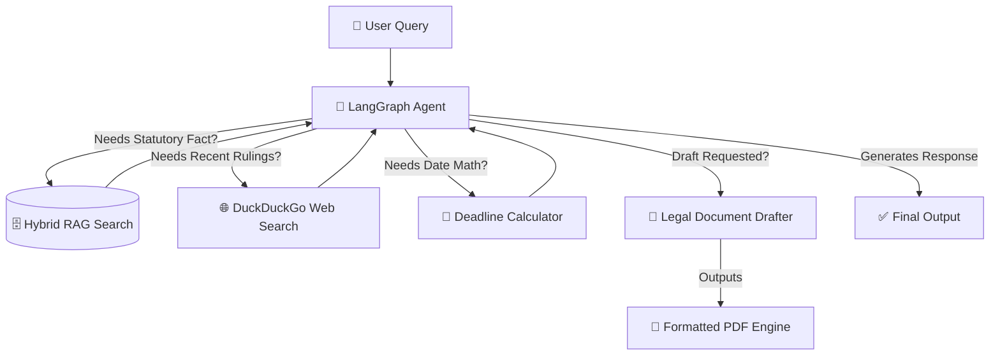
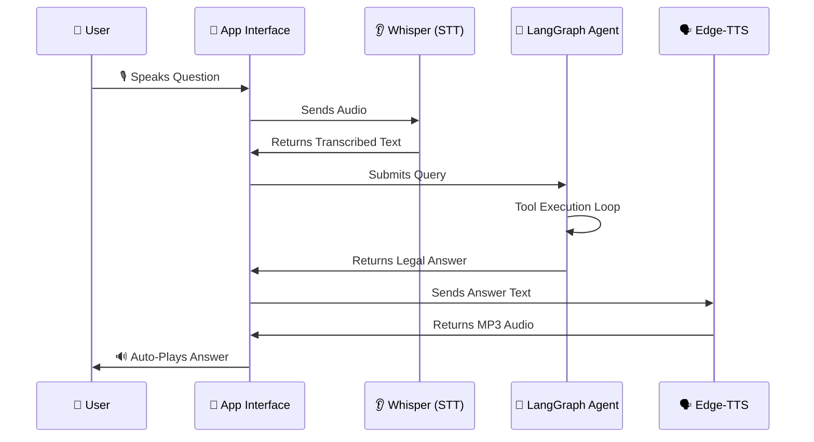

# 🇮🇳 Bharat Law GPT
**An advanced Agentic AI legal assistant for Indian Law, featuring a full LangGraph architecture, Hybrid RAG pipeline, and dynamic tool execution.**

## 📌 Overview
Bharat Law GPT is an AI system designed to answer complex legal questions, calculate legal deadlines, scrape the web for recent rulings, and instantly draft professional legal documents.

Unlike generic chatbots, this project uses **Agentic AI** powered by LangGraph, giving the LLM autonomous access to a suite of highly specialized tools.

This makes the system:
- **More accurate** (Answers grounded in uploaded PDFs via Hybrid FAISS/BM25 Search)
- **More autonomous** (Calculates dates and searches the web dynamically)
- **More useful** (Automatically asks for missing facts and drafts full legal documents)
- **Highly secure** (Strict system guardrails aggressively block non-legal queries)

Now featuring a **Dual-Mode Interface**:
1.  **💬 Text Mode:** Deep conversational interface with an interactive Draft Editor.
2.  **🎙️ Voice Mode:** Hands-free, voice-to-voice interaction.

---

## 🎨 Workflows & Architecture

### 1️⃣ The Agentic AI Loop (LangGraph)
The core "brain" of the application now operates as a ReAct Agent, allowing it to think and choose tools dynamically.



### 2️⃣ The Voice Interaction Loop
A hands-free voice experience for quick consultations.



---

## ✨ Features
- **LangGraph Agentic Architecture:** The AI operates autonomously, choosing between multiple tools to solve complex, multi-step user prompts.
- **Hybrid RAG Search:** Combines semantic Vector search (FAISS) with keyword search (BM25) to deeply mine uploaded legal PDFs for exact sections and acts.
- **Web Scraping:** If a case is too recent for the local database, the AI automatically spins up `ddgs` to scrape DuckDuckGo for live headlines.
- **Automated Document Drafter:** Tells the AI to draft a rent agreement or affidavit. It will interactively gather missing facts from you, silently generate the draft via an isolated LLM call (bypassing strict API limits), and inject it directly into the UI.
- **PDF Generation Engine:** Includes a custom `fpdf2` rendering pipeline that parses Markdown text and generates official-looking PDFs with Times New Roman typography, proper spacing, and a faded "DRAFT" watermark.
- **Security Guardrails:** Strictly enforced system prompts ensure the AI refuses any non-legal questions (coding, math, general trivia).
- **Dual Interface:** Switch seamlessly between Text and Voice modes using shared memory caching to prevent LLM reload lag.

---

## 📂 Project Structure

```text
bharat_law_gpt/
│
├── legal_docs/
│   └── pdf_files/          # Raw Indian legal documents used to build the vector DB
│
├── db/
│   └── faiss_store/        # Persistent FAISS & BM25 indexes
│
├── src/                    # Modular Architecture
│   ├── agent/              # LangGraph Agent, System Prompts, Tool Definitions
│   ├── rag/                # Hybrid Vectorstore & Embedding Logic
│   ├── ui/                 # Shared Dependencies & PDF Generation Logic
│   └── voice/              # STT (Whisper) & TTS (EdgeTTS) logic
│
├── pages/                  # Streamlit Pages
│   ├── app_text_ui.py      # Text Chat Interface & Draft Editor
│   └── app_voice_ui.py     # Voice Chat Interface
│
├── app_ui.py               # Main Landing Page / Portal
├── build_db.py             # Script to ingest PDFs and build the hybrid database
├── requirements.txt        # Python dependencies
└── README.md
```

---

## 🛠 Installation & Setup

### **1. Clone the repository**
```bash
git clone https://github.com/Rkgorai/bharat_law_gpt.git
cd bharat_law_gpt
```

### **2. Install Python dependencies**
```bash
uv pip install -r requirements.txt
```
*(We highly recommend using `uv` or creating a virtual environment).*

### **3. Install System Dependencies (Linux/Mac)**
Required for audio playback functionality.
```bash
sudo apt update
sudo apt install mpv ffmpeg
```

### **4. Add Legal PDFs**
Place your PDF files (Constitution, IPC, Acts) into:
```text
legal_docs/pdf_files/
```

### **5. Build the Database**
This step processes your PDFs and creates the FAISS/BM25 indexes.
```bash
python build_db.py
```

### **6. Set Environment Variables**
Create a `.env` file in the root directory and add your Groq API key:
```env
GROQ_API_KEY="your-api-key-here"
```

### **7. Run the Application**
Launch the main portal.
```bash
python -m streamlit run app_ui.py
```
Visit the URL shown (usually `http://localhost:8501`).

---

## 🧪 Example Prompts to Test Tools

**Test Deadline Calculator**
> "I received a legal notice today regarding a property dispute, and the law states I must file a reply within exactly 45 days. What is the exact date of my deadline?"

**Test Web Search**
> "Can you search the web for any recent Supreme Court of India rulings from this month regarding cryptocurrency?"

**Test Local RAG Database**
> "What are the specific provisions regarding maternity leave under the Maternity Benefit Act in India?"

**Test Document Drafter**
> "Please draft an 11-month residential rent agreement. The owner is Mr. ABC and the tenant is Mr. X. The monthly rent is 35,000 INR. The property address is House no 9, XYZ Street, Jamshedpur. The start date is today, the security deposit is 2 Lakh INR, and utility bills are generated monthly. Please include a strict clause that the house cannot be modified without permission."

---

## 🚧 Limitations
⚠️ **This system is NOT a substitute for professional legal advice.** It is an educational and research tool. AI can make mistakes ("hallucinations"), even with RAG and strict guardrails. Always verify with official legal sources or a qualified lawyer.

---

## 👥 Contributing
Contributions are welcome!
- Add more legal documents.
- Improve the RAG pipeline or prompts.
- Create new specialized LangGraph tools.

---

## ⭐ Support
If you find this project useful, please **star the repo ⭐**.
Your support encourages further development!
