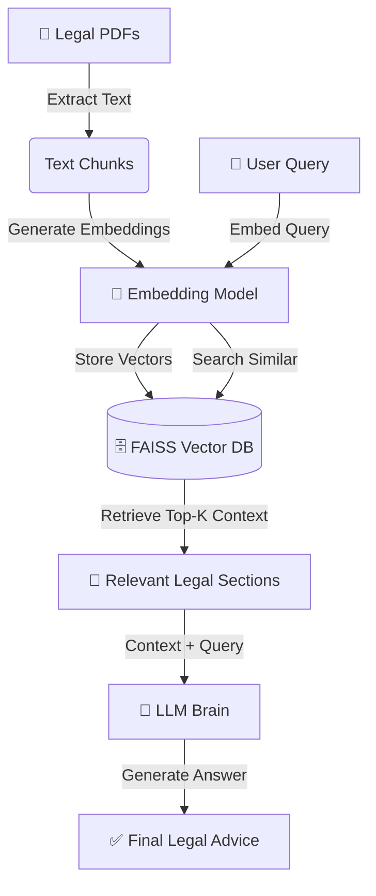
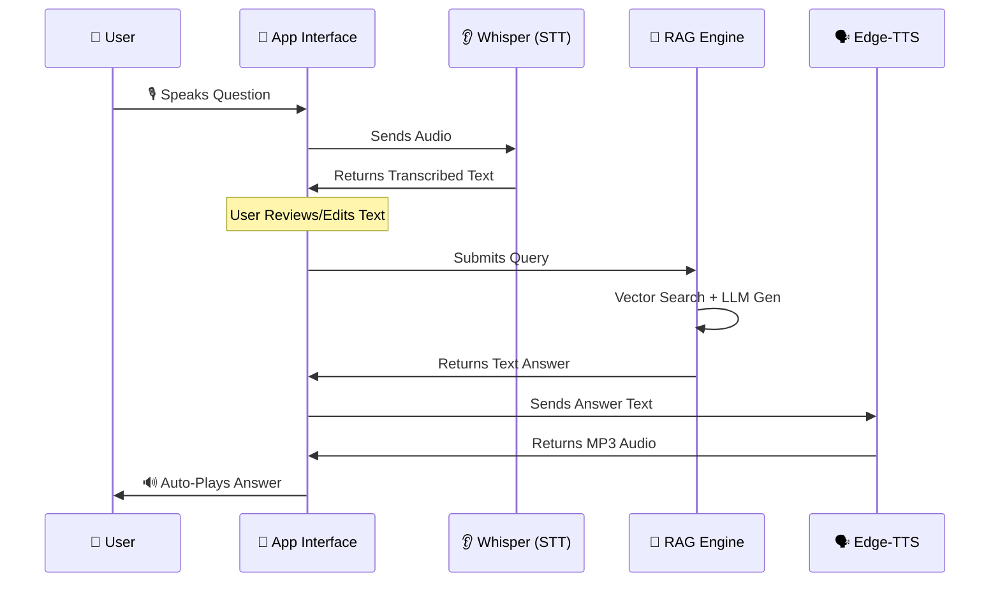

# 🇮🇳 Bharat Law GPT
**An AI-powered legal assistant for Indian Law using a complete Retrieval-Augmented Generation (RAG) pipeline.**

## 📌 Overview
Bharat Law GPT is an AI system designed to answer questions related to Indian laws, IPC sections, legal definitions, procedures, and more.
Unlike generic chatbots, this project uses **Retrieval-Augmented Generation (RAG)** to ground all answers on real legal documents.

This makes the system:
- **More accurate** (Answers grounded in uploaded PDFs)
- **More explainable** (Cites sources)
- **Less hallucination-prone**
- **More useful** for legal learners & professionals

Now featuring a **Dual-Mode Interface**:
1.  **💬 Text Mode:** Classic chat for detailed queries.
2.  **🎙️ Voice Mode:** Hands-free, voice-to-voice interaction with auto-stop and auto-play.

---

## 🎨 Workflows & Architecture

### 1️⃣ The RAG Pipeline (Core Brain)
This workflow explains how the system "reads" legal documents and answers questions.



### 2️⃣ The Voice Interaction Loop
This workflow explains the hands-free voice experience.



---

## ✨ Features
- **Retrieval-Augmented Generation (RAG):** Retrieves the most relevant legal documents **before** answering.
- **Dual Interface:** Switch seamlessly between Text and Voice modes.
- **Voice-to-Voice:**
  - Speak your query (STT).
  - Listen to the AI's legal advice (TTS).
  - Auto-hides "Stop" controls when the answer finishes.
- **Review & Edit:** Review your voice query text before submitting to ensure accuracy.
- **Optimized Performance:** Uses **Shared Resource Loading** to prevent model reloading when switching pages.
- **Modular Architecture:** Easy to add new documents or switch LLMs (Llama, Moonshot, Qwen, etc.).
- **Build Your Knowledge Base:** Script included to ingest your own PDF collection.

---

## 📂 Project Structure

```text
bharat_law_gpt/
│
├── legal_docs/
│   └── pdf_files/          # Raw Indian legal documents used to build the vector DB
│
├── db/
│   └── faiss_store/        # Persistent FAISS vector index (Generated)
│
├── src/                    # Core Logic
│   ├── search.py           # RAG Retrieval & LLM Chain
│   ├── voice_handler.py    # STT (Whisper) & TTS (EdgeTTS) logic
│   ├── shared.py           # Resource caching (prevents reload lag)
│   └── ...
│
├── pages/                  # Streamlit Pages
│   ├── app_text_ui.py      # Text Chat Interface
│   └── app_voice_ui.py     # Voice Chat Interface
│
├── app_ui.py               # Main Landing Page / Portal
├── build_db.py             # Script to ingest PDFs and build the database
├── requirements.txt        # Python dependencies
└── README.md
```

---

## 🛠 Installation & Setup

### **1. Clone the repository**
```bash
git clone https://github.com/Rkgorai/bharat_law_gpt.git
cd bharat_law_gpt
```

### **2. Install Python dependencies**
```bash
pip install -r requirements.txt
```

### **3. Install System Dependencies (Linux/Mac)**
Required for audio playback functionality.
```bash
sudo apt update
sudo apt install mpv ffmpeg
```

### **4. Add Legal PDFs**
Place your PDF files (Constitution, IPC, Acts) into:
```text
legal_docs/pdf_files/
```

### **5. Build the Database**
This step processes your PDFs and creates the FAISS index.
```bash
python build_db.py
```

### **6. Run the Application**
Launch the main portal.
```bash
python -m streamlit run app_ui.py
```
Visit the URL shown (usually `http://localhost:8501`).

---

## 🧪 Example Usage

**User (Voice Mode):** > 🎤 *Tap Record* -> "What are my rights if I get arrested?"

**System Flow:**
1. **Transcribe:** Audio -> "What are my rights if I get arrested?"
2. **Review:** User confirms the text.
3. **Retrieve:** FAISS fetches "DK Basu Guidelines" & "CrPC Section 41B".
4. **Generate:** LLM creates a summary of rights.
5. **Speak:** Audio generates and plays automatically.

**Output:** > "You have the right to know the grounds of arrest, the right to bail for bailable offenses, and the right to a lawyer..."

---

## 📌 Why This Project Is Useful
- **Legal Literacy:** Makes complex laws accessible to everyone via simple voice interaction.
- **Accuracy:** Unlike ChatGPT, this system cites specific acts and sections from your uploaded documents.
- **Accessibility:** Voice mode helps users who may prefer speaking over typing.

---

## 🧩 Future Enhancements
- [ ] Support for Hindi/Regional languages (STT & TTS).
- [ ] Citations dropdown in Voice Mode.
- [ ] Deployment to Cloud (Streamlit Cloud/HuggingFace Spaces).
- [ ] Integration with specialized legal LLMs (LawGPT).

---

## 🚧 Limitations
⚠️ **This system is NOT a substitute for professional legal advice.** It is an educational and research tool. AI can make mistakes ("hallucinations"), even with RAG. Always verify with official legal sources or a qualified lawyer.

---

## 👥 Contributing
Contributions are welcome!
- Add more legal documents.
- Improve the RAG pipeline or prompts.
- Create better UI components.

---

## ⭐ Support
If you find this project useful, please **star the repo ⭐**.
Your support encourages further development!
